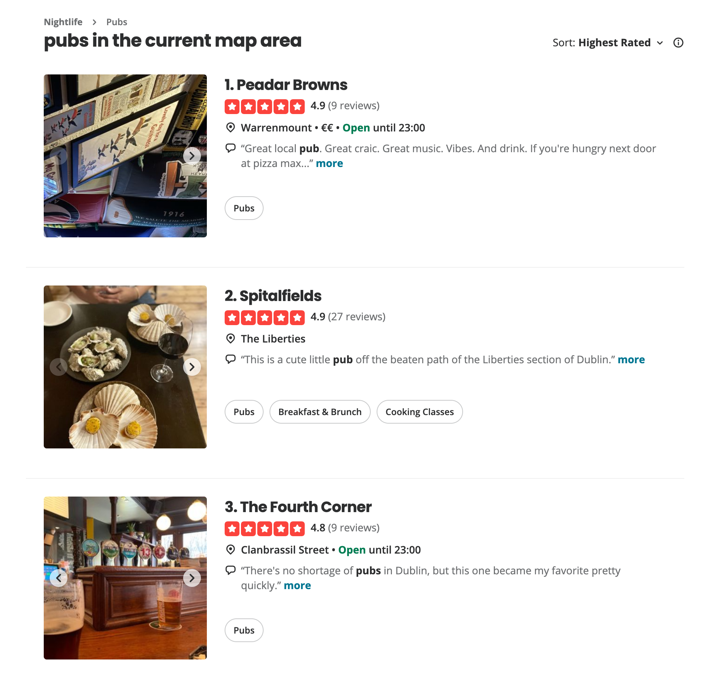

# Ratings

Social Maps uses a binary rating system whose options are:

- "I **recommend** this place" and
- "I **do not recommend** this place"

We prefer the term "recommend" over "like" (and "dislike") to emphasise the aim of Social Maps, which is, to be a review database for points of interest (POIs) created by people for people.

You can think of "do not recommend" as _recommending against_; if a user is truly indifferent to or indecisive about a place then they should not rate it either.

## Binary vs multi-choice ratings
Many existing and well established review systems such as [Google Maps](https://support.google.com/maps/answer/6230175), [TripAdvisor](https://www.tripadvisor.com/business/insights/resources/bubble-rating), and [Yelp](https://www.yelp.com/writeareview) use multi-choice ratings (e.g. 1 to 5 stars), so why does Social Maps use binary ratings?

The main reason why Social Maps uses binary over multi-choice ratings is that binary ratings are much easier to reason about and work with mathematically, which makes it possible for us to do some interesting and valuable calculations that are not as easy or perhaps even possible with multiple-choices.

### J-curves
On the surface, multi-choice rating provide more information as it can capture the nuances of "how much" a user liked/recommends a place to others. For example, TripAdvisor and Yelp define the number of stars as:

| Stars | TripAdvisor | Yelp |
|---:|:---|:---|
| 1 | "Terrible" | "Not good"|
| 2 | "Poor" | "Could've been better" |
| 3 | "Average" | "OK" |
| 4 | "Good" | "Good" |
| 5 | "Excellent" | "Great" |

However, if we were to calculate the distribution of stars and graph them, we'd see that "these graphs have what is known to reputation system aficionados as J-curves&mdash;where the far right point (5 Stars) has the very highest count, 4-Stars the next, and 1-Star a little more than the rest."[^1] Indeed, you can observe this yourself in the distribution of stars in [Yelp Open Dataset](https://business.yelp.com/data/resources/open-dataset/) (6,990,280 reviews in total):

```vegalite
{
  "data": {
    "values": [
      {"s": "1", "r": 15},
      {"s": "2", "r": 8},
      {"s": "3", "r": 10},
      {"s": "4", "r": 21},
      {"s": "5", "r": 46}
    ]
  },
  "transform": [
    {"calculate": "datum.r + '%'", "as": "r_label"}
  ],
  "height": 400,
  "encoding": {
    "x": {
      "field": "s",
      "type": "nominal",
      "axis": {
        "title": "Stars",
        "labelAngle": 0
      }
    },
    "y": {
      "field": "r",
      "type": "quantitative",
      "axis": {
        "title": "Ratio",
        "labelExpr": "datum.label + '%'"
      }
    }
  },
  "layer": [
    {
      "mark": "bar"
    },
    {
      "mark": {
        "type": "text",
        "baseline": "bottom",
        "dy": -8
      },
      "encoding": {
        "text": {"field": "r_label", "type": "nominal"}
      }
    }
  ],
  "config": {
    "axis": {
      "titleFontSize": 16,
      "labelFontSize": 16
    },
    "text": {
      "fontSize": 16
    }
  }
}
```

The data shows us that more than 60% of the reviews consist of 1- and 5-star _extremes_, which is the opposite of a bell curve if we were to believe that most places deserve something between 3- and 4-stars and that "excellent"/"great" places are a rare a few. Therefore, we can conclude that there isn't as much "nuance" to how much users like/recommend a place. We wouldn't lose much by simplifying our multi-choice rating to binary, and we would gain additional clarity on 3-star reviews as we force users to reveal whether they think of 3-star as good or bad. YouTube has reached the same conclusion in 2009[^2], replacing its star-based ratings with a binary like/dislike.

## Calculations on binary ratings
In the previous section we said that binary ratings are much easier to reason about and work with mathematically, which makes it possible for us to do some interesting and valuable calculations that are not as easy or perhaps even possible with multiple-choices. In this section, we're going to explain what does calculations are and what makes them interesting and valuable to our users.

### Calculating the sort score
In his famous piece "How Not To Sort By Average Rating"[^3], Evan Miller eloquently explains the problem of sorting and how _not_ to do it:

> **PROBLEM**: You are a web programmer. You have users. Your users rate stuff on your site. You want to put the highest-rated stuff at the top and lowest-rated at the bottom. You need some sort of "score" to sort by.

> **WRONG SOLUTION #1**: Score = (Positive ratings) − (Negative ratings)
>
> _Why it is wrong_: Suppose one item has 600 positive ratings and 400 negative ratings: 60% positive. Suppose item two has 5,500 positive ratings and 4,500 negative ratings: 55% positive. This algorithm puts item two (score = 1000, but only 55% positive) above item one (score = 200, and 60% positive). WRONG.

> **WRONG SOLUTION #2**: Score = Average rating = (Positive ratings) / (Total ratings)
>
> _Why it is wrong_: Average rating works fine if you always have a ton of ratings, but suppose item 1 has 2 positive ratings and 0 negative ratings. Suppose item 2 has 100 positive ratings and 1 negative rating. This algorithm puts item two (tons of positive ratings) below item one (very few positive ratings). WRONG.

Wrong Solution #2 is the most common and one that we still encounter on numerous services such as Yelp:

<figure markdown="span">
  
  <figcaption>A screenshot of a Yelp search. Notice how sorting by "highest rated" ranks places with only a handful of all-positive reviews far above those with hundreds of positive reviews.</figcaption>
</figure>

For the "Correct Solution" however, we'll look elsewhere: in their paper "How to Count Thumb-Ups and Thumb-Downs: User-Rating Based Ranking of Items from an Axiomatic Perspective"[^4], Zhang _et al._ discuss potential solutions to the problem outlined by Evan Miller and evaluate them based on the following criteria (axioms):

> 1. **The Law of Increasing Total Utility** <br />
>    For any pair of non-negative integer numbers of thumb-ups and thumb-downs $n_{\uparrow}, n_{\downarrow} \in \mathbb{Z}^{*}$, a reasonable score function $s$ must satisfy the following rules: [...] that each additional thumb-up or thumb-down should always make the score higher or lower correspondingly.
> 2. **The Law of Diminishing Marginal Utility** <br />
>   For any pair of non-negative integer numbers of thumb-ups and thumb-downs $n_{\uparrow}, n_{\downarrow} \in \mathbb{Z}^{*}$, a reasonable score function s must satisfy the following rules: [...] that the difference made by each additional thumb-up or thumb-down to the score should decrease as the number of thumb-ups or thumb-downs increases.

Evaluating potential solutions (ranking methods), Zhang _et al._ gets the following results:

> | Ranking Method | Increasing Total Utility | Diminishing Marginal Utility
> |:---|:---:|:---:|
> | Difference | Y | N |
> | Proportion | N | N |
> | Wilson Interval | N | N |
> | Laplace smoothing | Y | Y |
> | Lidstone smoothing | Y | Y |
> | Absolute Discounting smoothing | N | N |
> | Jelinek-Mercer smoothing | N | N |
> | Dirichlet Prior smoothing | Y | Y |

You can see in the table that "Dirichlet Prior smoothing method as well as its special cases (Laplace smoothing and Lidstone smoothing) can satisfy both axioms".

We chose Laplace smoothing because it's the simplest one out of three. For its formula, we're quoting Zhang _et al._ once again:

> One of the simplest way to assign non-zero probabilities to unseen terms is Laplace smoothing (a.k.a. Laplace’s rule of succession), which assumes that every item "by default" has $1$ thumb-up and $1$ thumb-down (known as pseudo-counts):
>
> $$
> s\left(n_{\uparrow}, n_{\downarrow}\right) = \frac{n_{\uparrow} + 1}{\left(n_{\uparrow}+1\right) + \left(n_{\downarrow}+1\right)}
> $$
> 
> If item $i$ has received $2$ thumb-ups and $0$ thumb-down from users, it would have $1+2=3$ thumb-ups and $1+0=1$ thumb-downs in total, so $s(2, 0) = 3/(3 + 1) = 0.75$. If item $j$ has got $100$ thumb-ups and $1$ thumb-down, it would have $100+1=101$ thumb-ups and $1+1=2$ thumb-downs in total, so $s(100, 1) = 101/(101+2) = 0.98$. Thus we see that item $j$ would be ranked higher than item $i$, which is indeed desirable.

### Calculating the decay
In his other influential piece "Bayesian Average Ratings"[^5], Evan Miller introduces the concept of "rating decay":

> Next I want to describe a way to let ratings "cool off", for example, if we have reason to believe that older ratings are not as informative as newer ratings. [...]
>
> The simplest approach is to use a technique called exponential decay. The decay process takes a single parameter called the half-life, which corresponds to the amount of time it takes for a particular rating’s influence to diminish by half.
>
> To implement exponential decay, simply keep track of the number of up-votes and down-votes as before, and alongside them keep track of the time of the most recent up-vote and most recent down-vote. Then instead of the usual update process, you'll use the formula:
> 
> $$
> \text{new} = \text{old} \times 2^{-t/H}+1
> $$
>
> Where $H$ is the half-life and $t$ is the amount of time that has elapsed since the most recent update. Note that because this decay is a continuous process, you will need to store the rating counts as floating-point numbers instead of round integers.
>
> In addition, when calculating the current sorting criterion, you'll need to take the rating decay into account. [...]

Because we're not using the ranking method (i.e. score formula) in Evan Miller's article, we need to integrate the decay into our score formula ourselves:

$$
s\left(n_{\uparrow}, n_{\downarrow}\right) = \frac{n^*_{\uparrow} + 1}{\left(n^*_{\uparrow}+1\right) + \left(n^*_{\downarrow}+1\right)}
$$

where

$$
\begin{align*}
n^*_{\uparrow} &= n_{\uparrow} \times 2^{-t_{\uparrow}/H} \\
n^*_{\downarrow} &= n_{\downarrow} \times 2^{-t_{\downarrow}/H}
\end{align*}
$$

and $t_{\uparrow}$ and $t_{\downarrow}$ are the time since the most recent up-vote and down-vote respectively.

[^1]:
    R. Farmer, "Ratings Bias Effects," _Building Web 2.0 Reputation Systems: The Blog_, Aug. 12, 2009. https://web.archive.org/web/20090815133001/https://buildingreputation.com/writings/2009/08/ratings_bias_effects.html (accessed Sep. 28, 2025).

[^2]:
    S. Rajaraman, "Five Stars Dominate Ratings," _YouTube Blog_, Sep. 22, 2009. https://web.archive.org/web/20090923080103/http://youtube-global.blogspot.com/2009/09/five-stars-dominate-ratings.html (accessed Sep. 28, 2025).

[^3]:
    E. Miller, "How Not To Sort By Average Rating," _evanmiller.org_, Feb. 06, 2009. https://www.evanmiller.org/how-not-to-sort-by-average-rating.html (accessed Sep. 28, 2025).

[^4]:
    D. Zhang, R. Mao, H. Li, and J. Mao, "How to Count Thumb-Ups and Thumb-Downs: User-Rating Based Ranking of Items from an Axiomatic Perspective," in _Advances in Information Retrieval Theory_, Springer, Jan. 2011, pp. 238–249. doi: https://doi.org/10.1007/978-3-642-23318-0_22.

[^5]:
    E. Miller, "Bayesian Average Ratings," _evanmiller.org_, Nov. 06, 2012. https://www.evanmiller.org/bayesian-average-ratings.html (accessed Sep. 28, 2025)
